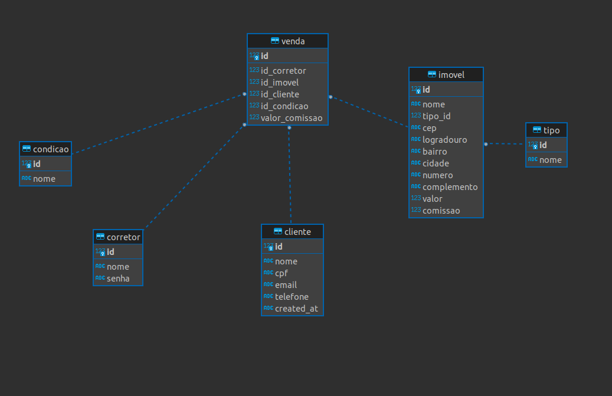

# Desafio Strategi

Projeto desenvolvido para demonstrar conhecimentos para processo seletivo na Strategi Consultoria
***
## O Problema
Desenvolva uma pequena aplicação web de venda de imóveis onde um vendedor faz o login na aplicação, escolhe o imóvel(Apartamento ou Lote) na tela de seleção devem aparecer a localização do imóvel, valor de venda, valor de comissão do vendedor(5%) e qualquer outra informação que você queria colocar na tela, realiza a simulação de pa	gamento do imóvel (à vista ou 180 parcelas), escolhe o cliente que a venda será realizada e na tela final apresenta um resumo(extrato do financiamento) de toda a transação: Quem foi o vendedor, qual foi o imóvel, para quem foi vendido o imóvel e as condições de pagamento e extrato. Considere utilizar a API de CEP para popular o endereço do cliente, imóvel ou vendedor.

## Ressalvas
É necessário criar o CRUD do cadastro do cliente. Não é necessário criar as telas de cadastro de imóvel e nem cadastro de vendedor.

## Premissas
1. Documente todo o código
2. Utilize algum ORM
3. Utilize qualquer banco de dados
4. Utilize Flask
5. SQLiter
***
## Como rodar a aplicação
#### Com docker
`$ docker image build -t desafio_strategi .`
`$ docker run -p 5000:5000 -d desafio_strategi`
#### CLI
`$ python3 run.py`

O app irá iniciar na porta localhost:5000

## Logando na aplicação
usuário = gabriel
senha = 123456

## Funcionalidades da aplicação
1. O usuário pode fazer o login
2. Na tabela de imóveis do dashboard poderá:
   1. Editar um imóvel
      1. Ao digitar o cep a aplicação consulta uma API para pegar o restante do endereço
   2. Excluir um imóvel
   3. Simular uma venda
      1. Realizar a venda slecionando o cliente e forma de pagamento
3. Na aba de clientes poderá
   1. Adicionar um cliente
   2. Editar um cliente
   3. Excluir um cliente
4. Na aba de vendas  poderá
   1. Deletar uma venda
      1. Ao deletar uma venda o imóvel voltará a constar no dashboard
   2. Abrir extrato da venda em outra aba
      1. Poderá imprimir o extrato
5. O usuáraio poderá clicar no icone de toggle (três linhas) ao lado do título de cada página para esconder o painel
      

## Tecnologias utilizadas nesse projeto
- Python + Flask
- SQLalchemy ORM
- Bootstrap 5
- Jinja 2

## Organização do projeto
strategi-desafio 
├── app (Folder da aplicação)
│   ├── forms.py
│   ├── models.py
│   ├── routes.py
│   ├── static (Arquivos estáticos, imagens, CSSs e scripts)
│   │   ├── img (pasta de imagens estáticas)
│   │   └── styles (pasta com arquivos de estilo)
│   │   └── script (pasta com scripts frontend da aplicação
│   ├── templates (Arquivos HTML da aplicação)
│   └── util.py (Funções auxiliares)
├── config.py ( Arquivo responsável por popular o banco de dados inicialmente)
├── instance (Caso não exista, essa pasta será criada quando o app for inicializado a primeira vez)
│   └── imoveisvendas.sqlite3 (Bando de dados SQLite)
├── README.md (Este arqiuvo)
├── requirements.txt (lista de pacotes e bibliotecas necessárias para o Python rodar a aplicação)
└── run.py (Arquivo que deverá ser executado para iniciar o servidor e aplicação)

## Modelo do Banco de Dados

